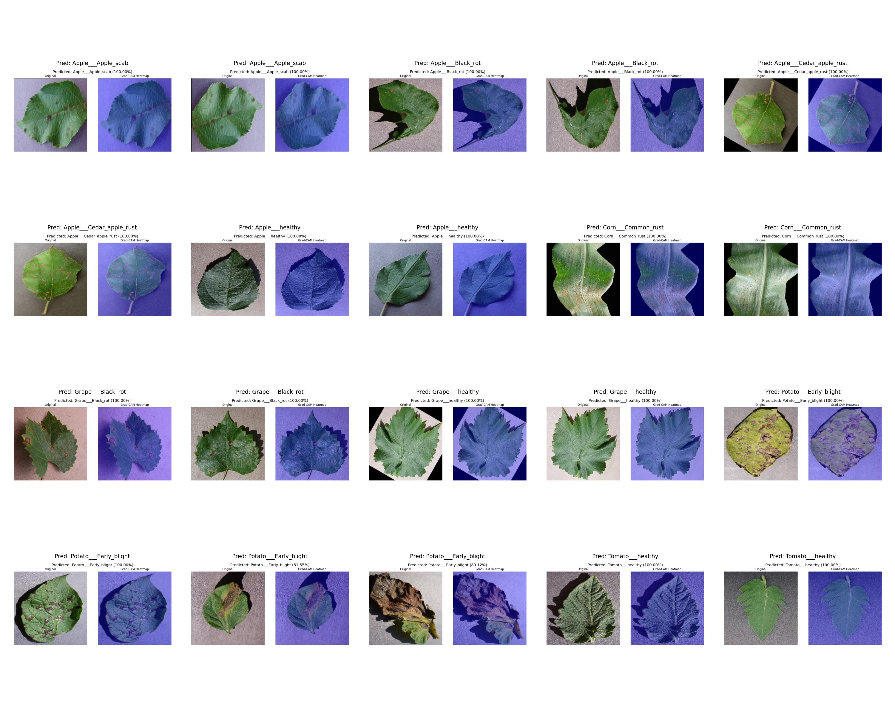

# 🌿 LoRA Fine-Tuned Plant Disease Classifier with Grad-CAM Explainability


## 📖 Project Overview

This project implements a production-grade **vit_base_patch16_224** model from **timm** for plant disease classification using Parameter-Efficient Fine-Tuning (PEFT). By leveraging Low-Rank Adaptation (LoRA), we drastically reduce the computational resources required for training while maintaining state-of-the-art accuracy on a 10-class subset of the PlantVillage dataset (Apple Scab, Apple Black Rot, Apple Cedar Rust, Apple Healthy, Corn Common Rust, Grape Black Rot, Grape Healthy, Potato Early Blight, Tomato Bacterial Spot, Tomato Healthy). The model correctly identifies plant health states—vital for precision agriculture and early disease intervention.

The headline achievement of this pipeline is its efficiency: **only 0.35% of the model parameters are trained**. Instead of fine-tuning the entire network, LoRA injects trainable low-rank matrices into the target `qkv` attention layers across all 12 blocks. This enables rapid training on a single T4 GPU in Google Colab while preventing catastrophic forgetting of the foundational features learned by the base ViT model.

To bridge the gap between model accuracy and real-world trust, this project integrates **Grad-CAM explainability**. For AI systems deployed in critical domains like agriculture, simply outputting a prediction is not enough. Grad-CAM generates heatmaps highlighting exactly which visual features (e.g., leaf spots, discoloration) drove the model's decision, allowing agronomists and end-users to visually verify and trust the network's reasoning.

## 🧠 Architecture Diagram

```text
       Input Image 
            │
            ▼
    [ Preprocessing ]  (Resize 256 → CenterCrop 224 → Normalize)
            │
            ▼
 ┌──────────────────────┐
 │   ViT Base (Frozen)  │  ◄── Pretrained timm vit_base_patch16_224
 │ ┌──────────────────┐ │
 │ │ Block 0 ... 11   │ │
 │ │  [Q, K, V]       │ │  ◄── LoRA Adapters injected (Trainable)
 │ └──────────────────┘ │
 └──────────┬───────────┘
            │
            ▼
    [ Classifier Head ]    (Trainable Linear Layer)
            │
            ├───> [ Prediction (Class & Confidence) ]
            │
            ▼
    [ Grad-CAM Engine ]    (Targets block 11 norm1, custom reshape)
            │
            ▼
   [ Heatmap Overlay ]     (Visual explanation of model focus)
```

## 📊 Key Results

| Metric | Value |
|--------|-------|
| **Test Accuracy** | 100% |
| **Number of Classes** | 10 |
| **Trainable Parameters** | 302,602 (0.35%) |
| **Total Parameters** | 86,101,258 |
| **Training Device** | Google Colab T4 GPU |
| **LoRA Rank** | 8 |
| **LoRA Alpha** | 16 |
| **Base Model** | vit_base_patch16_224 |

## 🔍 Grad-CAM Visualizations



**How to interpret these heatmaps:**
The colors represent the model's spatial attention when making its prediction. 
- **Red/Yellow regions:** High attention. The model focused heavily on these specific pixels (e.g., disease spots or lesions) to determine the class.
- **Blue/Cool regions:** Low attention. These areas were deemed irrelevant to the final prediction.

### Misclassifications

> Note: Tomato Bacterial Spot shows some confusion with Potato Early Blight — both present as brown lesion patterns, a known challenge in plant pathology datasets.

## 📁 Project Structure

```text
lora-image-classifier/
├── api/
│   └── main.py                # FastAPI application with predict/explain endpoints
├── notebooks/
│   └── colab_training.ipynb   # Full Colab training notebook with Drive integration
├── src/
│   ├── dataset.py             # PyTorch Datasets, dataloaders, and transforms
│   ├── model.py               # Model loading, freezing, and PEFT LoRA adapter setup
│   ├── train.py               # Training loop with validation and early stopping
│   ├── evaluate.py            # Evaluation logic, confusion matrix, and misclassifications
│   ├── gradcam.py             # Grad-CAM implementation with ViT reshape transform
│   └── download_dataset.py    # Kaggle API script to fetch PlantVillage dataset
├── config.py                  # Centralized configuration dataclass
├── requirements.txt           # Project dependencies
├── .gitignore                 # Ignored files and output directories
└── README.md                  # Project documentation
```

## 🚀 Setup & Usage

### 1. Clone repo
```bash
git clone https://github.com/anantha037/lora-image-classifier.git
cd lora-image-classifier
```

### 2. Install dependencies
```bash
pip install -r requirements.txt
```

### 3. Download dataset
```bash
python src/download_dataset.py
```

### 4. Training
Training is designed to be executed in Google Colab. Open `notebooks/colab_training.ipynb` in Colab, mount your Google Drive, and run the cells sequentially. The trained adapter weights will be saved to your Google Drive. Download them and place them in the `outputs/checkpoints/` directory.

### 5. Run Grad-CAM Demo
Once weights are present, you can generate the summary grid of Grad-CAM explanations:
```bash
python src/gradcam.py
```

### 6. Run API
Launch the FastAPI server to serve predictions and explainability natively:
```bash
uvicorn api.main:app --reload --port 8000
```
Interactive API docs will be available at: http://localhost:8000/docs

## 🌐 API Documentation

| Endpoint | Method | Description | Input | Output |
|----------|--------|-------------|-------|--------|
| `/health` | GET | Check API and model status | None | JSON with status, classes count, and device |
| `/classes` | GET | List all supported disease classes | None | JSON list of class names |
| `/predict` | POST | Predict disease from an image | Form-Data Image | JSON with predicted class, confidences, and time |
| `/explain` | POST | Generate prediction + Grad-CAM overlay | Form-Data Image | JSON with prediction and base64 encoded PNG heatmap |

### Example cURL Requests

**Predict Endpoint:**
```bash
curl -X 'POST' \
  'http://localhost:8000/predict' \
  -H 'accept: application/json' \
  -H 'Content-Type: multipart/form-data' \
  -F 'image=@data/plantvillage/Apple___Apple_scab/image_name.jpg;type=image/jpeg'
```

**Explain Endpoint:**
```bash
curl -X 'POST' \
  'http://localhost:8000/explain' \
  -H 'accept: application/json' \
  -H 'Content-Type: multipart/form-data' \
  -F 'image=@data/plantvillage/Apple___Apple_scab/image_name.jpg;type=image/jpeg'
```

## 🛠️ Tech Stack

| Library | Version | Purpose |
|---------|---------|---------|
| **PyTorch** | 2.1.0+ | Deep learning framework and tensor operations |
| **timm** | 0.9.12 | Pre-trained Vision Transformer models |
| **PEFT** | 0.7.1 | Low-Rank Adaptation (LoRA) implementation |
| **grad-cam** | 1.5.0 | Explaining model predictions visually |
| **FastAPI** | 0.108.0 | High-performance async web API framework |
| **scikit-learn** | 1.3.2 | Stratified train/val/test data splitting |

## 🎓 What I Learned

- **Parameter-Efficient Fine-Tuning with LoRA:** I learned how to successfully adapt large foundation models (like ViT) using fractions of the computational cost by freezing the base model and injecting small trainable rank-decomposition matrices.
- **ViT Architecture and Attention Mechanism:** I gained deep insights into how Vision Transformers divide images into patches, process sequence tokens, and route information through Multi-Head Self-Attention layers.
- **Grad-CAM Reshape Transform:** I tackled the specific challenge of implementing Grad-CAM for token-based architectures. This required writing custom transformations to bypass the CLS token and reconstruct 2D spatial feature grids from flat sequences.
- **Production API Design with FastAPI Lifespan:** I mastered serving PyTorch models in a robust production setting, specifically utilizing async context managers (`lifespan`) to load the model securely at startup and avoid memory leaks.

## 📄 License

This project is licensed under the MIT License - see the LICENSE file for details.
